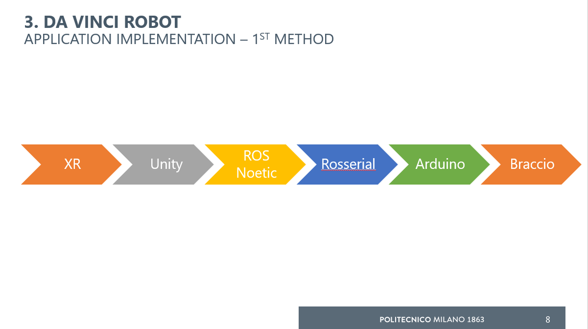
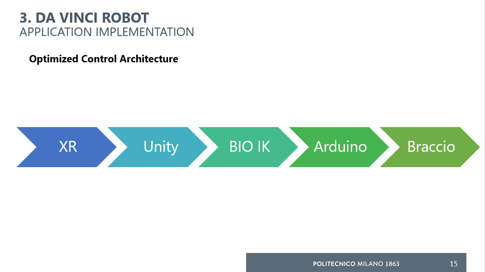

# XR Teleoperation of a Physical Braccio Robot

**Unity · Meta Quest · ROS Noetic · MoveIt · RViz · BioIK · Arduino · Braccio**

Team-based academic robotics project exploring intuitive XR teleoperation of a physical **Arduino Braccio robotic arm**.

The project progressed through two working control architectures:

1. a ROS-based teleoperation pipeline using **Unity, ROS Noetic, MoveIt, RViz and rosserial**
2. an optimized architecture using **BioIK directly inside Unity** to reduce the latency observed during real-time teleoperation

The final prototype allowed an operator to move an XR controller and command a physical Braccio robot through a corresponding end-effector target.

> **Project status:** Completed academic prototype.

---

## Project Overview

The objective was to create an intuitive teleoperation interface in which an operator could control a physical robot through natural movement in XR.

The system combines:

- Meta Quest XR tracking
- Unity as the operator interface
- a virtual Braccio robot model
- inverse kinematics
- robot communication middleware
- Arduino-based servo control
- a physical Braccio manipulator

A virtual robot was used as the digital representation of the physical system, allowing commands to be visualised and debugged before execution on the real hardware.

---

## My Contributions

This was a **team project**.

My contributions focused primarily on the XR, robotics communication and hardware-integration pipeline.

I worked on:

- Meta Quest / XR controller tracking in Unity
- integration between Unity and ROS
- ROS development and testing on Ubuntu
- Unity ↔ ROS communication using ROS-TCP
- ROS ↔ Arduino communication
- Arduino ↔ Braccio hardware integration
- locating and integrating a URDF model of the Braccio robot
- configuring the robot model for RViz / ROS-based visualisation and kinematics
- testing the initial MoveIt / RViz control architecture
- debugging communication between the simulation and physical robot
- migrating inverse kinematics into Unity using BioIK after latency was observed in the ROS-based pipeline
- integrating BioIK output with serial communication to the Arduino
- testing the final system on the physical Braccio arm

Some implementation and debugging was performed with AI-assisted coding. I designed, integrated, tested and iterated the robotics communication pipeline and validated it on the physical hardware.

Third-party frameworks, robot models and libraries are acknowledged below and are not claimed as my own work.

---

# System Development

## Version 1 — ROS-Based Architecture


The first implementation followed a conventional robotics middleware architecture:

```text
Meta Quest / XR Controller
          │
          ▼
        Unity
          │
      ROS-TCP
          │
          ▼
     ROS Noetic
          │
    ┌─────┴─────┐
    │           │
  MoveIt       RViz
 IK / planning  visualisation
    │
    ▼
Joint Commands
    │
 rosserial
    │
    ▼
   Arduino
    │
    ▼
Physical Braccio
```

### Communication Pipeline

Unity and ROS communicated using the Unity **ROS-TCP Connector**.

The project used ROS topics including:

```text
/braccio_angles
Unity → ROS
std_msgs/Float32MultiArray
```

```text
/braccio_joint_targets
ROS → Arduino
std_msgs/Float32MultiArray
```

```text
/joint_states
Robot state / RViz
sensor_msgs/JointState
```

A fixed joint ordering was maintained throughout the communication pipeline:

```text
base
shoulder
elbow
wrist vertical
wrist rotation
gripper
```

Maintaining a consistent joint convention was important because the same robot state passed through Unity, ROS, the kinematic model and the physical Arduino controller.

---

## Robot Model and URDF

A simplified URDF model of the Braccio robot was used to maintain a consistent kinematic representation between the virtual and physical systems.

The model defined:

- robot links
- revolute joints
- joint hierarchy
- joint limits
- kinematic relationships

The URDF was used for robot visualisation and kinematic reasoning in the ROS environment.

The virtual robot structure was also represented inside Unity.

> The original robot CAD/URDF resources were obtained from external/open resources and were not created from scratch by me.

---

## MoveIt and RViz

In the first architecture, ROS handled the robot kinematics.

MoveIt was used to convert a desired target pose into a valid robot joint configuration.

The development workflow used:

- URDF robot model
- MoveIt
- KDL inverse-kinematics solver
- RViz
- interactive visualisation
- trajectory planning
- joint-limit constraints

RViz was particularly useful for inspecting:

- current robot state
- target configurations
- planned robot motion
- joint behaviour
- coordinate-frame consistency

---

## ROS to Arduino

The physical Braccio was controlled through an Arduino.

In the first architecture:

```text
ROS
 │
 │ joint targets
 ▼
rosserial
 │
 ▼
Arduino
 │
 ▼
Braccio servo motors
```

Arduino received the target joint angles and converted the higher-level robotics commands into servo actuation.

The hardware layer provided a final boundary between the robotics software stack and the physical manipulator.

---

# Engineering Iteration

## Problem Observed

The ROS-based system was functional, but during physical XR teleoperation we observed that the response was not sufficiently immediate for the desired interaction.

The control path involved several stages:

```text
Unity
→ ROS-TCP
→ ROS
→ MoveIt / IK
→ rosserial
→ Arduino
→ Braccio
```

MoveIt provided useful planning and robotics tooling, but the additional processing and communication layers made the system less responsive for continuous XR control.

This led us to redesign the architecture around the primary requirement:

> **responsive real-time teleoperation**

---

# Version 2 — Optimized Control Architecture

Inverse kinematics was moved directly into Unity using **BioIK**.


The final control architecture became:

```text
Meta Quest / XR Controller
          │
          ▼
        Unity
          │
          ▼
        BioIK
    inverse kinematics
          │
          ▼
    Joint Angles
          │
     USB Serial
          │
          ▼
       Arduino
          │
          ▼
   Physical Braccio
```

This removed ROS, ROS-TCP, MoveIt and rosserial from the **real-time control loop**.

ROS remained an important part of the development and testing process, but it was no longer required for the final low-latency teleoperation path.

---

## BioIK Integration

BioIK was used inside Unity to solve the inverse-kinematics problem.

The XR controller defines the desired end-effector behaviour.

BioIK then determines corresponding robot joint targets subject to the configured joint structure and constraints.

The Unity control script retrieves target values for:

- base
- shoulder
- elbow
- vertical wrist
- rotational wrist

The resulting joint values are converted into Braccio-compatible servo commands.

---

## Unity to Arduino Serial Bridge

The final Unity implementation sends joint commands directly to the Arduino through a serial connection.

The current recovered implementation uses:

```text
Baud rate: 115200
Send interval: 0.1 s
```

The Unity bridge:

1. reads joint targets from BioIK
2. converts them into servo-compatible ranges
3. builds a six-joint command
4. sends the command through the serial port
5. repeats during teleoperation

Example command format:

```text
M1 M2 M3 M4 M5 M6
```

where each value represents a Braccio servo target.

---

## Arduino Control

The Arduino firmware supports three operating modes:

### HOME

Moves the robot to a predefined home configuration.

```text
h
```

### MANUAL

Allows individual motors to be commanded manually for testing.

```text
m
```

### UNITY

Receives the full six-joint command generated by the Unity/BioIK teleoperation system.

```text
u
```

In Unity mode, the Arduino receives:

```text
joint1 joint2 joint3 joint4 joint5 joint6
```

and applies these targets to the six Braccio servos.

This separation between manual and Unity modes was useful during integration and hardware debugging.

---

# Final System

The final demonstrated pipeline was:

```text
XR Controller
     │
     ▼
Meta Quest Tracking
     │
     ▼
Unity
     │
     ▼
End-Effector Target
     │
     ▼
BioIK
     │
     ▼
Robot Joint Targets
     │
     ▼
Serial Communication
     │
     ▼
Arduino
     │
     ▼
Braccio Servo Control
     │
     ▼
Physical Robot Motion
```

The prototype successfully demonstrated XR-driven control of the physical Braccio robot.

---

## Hardware

- Arduino Braccio robotic arm
- Arduino
- Braccio servo motors
- Meta Quest headset and controller
- development PC
- USB serial connection

A custom pencil holder was also integrated for the drawing demonstration.

---

## Software

### Robotics

- ROS Noetic
- MoveIt
- RViz
- rosserial
- URDF

### XR / Simulation

- Unity
- Meta Quest / XR
- BioIK
- C#

### Embedded

- Arduino
- Arduino C/C++
- Braccio library
- serial communication

### Development Environment

- Ubuntu Linux
- Git

---

# Demonstration

## Final XR Teleoperation

> **Video to be added**

The final demonstration shows the Meta Quest / Unity / BioIK system controlling the physical Braccio robot.

`media/final_teleoperation_demo.mp4`

## ROS / RViz Development Version

> **Video to be added**

An earlier demonstration shows the ROS / RViz architecture and the delay observed during teleoperation.

`media/ros_rviz_latency_demo.mp4`

These two demonstrations are useful for showing the engineering progression from the initial architecture to the optimized solution.

---

# Recovered Source Code

The public version of this repository contains only source code that can be clearly attributed to this project.

Planned structure:

```text
xr-braccio-teleoperation/
│
├── README.md
│
├── src/
│   └── unity/
│       └── BraccioBioIKBridge.cs
│
├── firmware/
│   └── braccio_controller.ino
│
├── docs/
│   └── architecture.md
│
└── media/
    ├── diagrams/
    └── demos/
```

Not all source code from the original academic project was recovered.

In particular, some ROS-side development files from the first architecture are currently unavailable. The ROS architecture is therefore documented here based on the final project documentation rather than presented as fully reproducible source code.

---

# Running the Current Recovered Implementation

The complete original Unity project is not currently included.

The recovered implementation requires:

- Unity
- a compatible BioIK installation
- the Braccio robot model configured with BioIK joints
- Arduino with the Braccio library
- a serial connection between the development computer and Arduino

The Unity script expects the BioIK segments corresponding to the Braccio joints and transmits the resulting target values to the Arduino.

Exact Unity scene configuration and XR setup instructions will be added if the original project files are recovered.

---

# Results and Engineering Outcomes

The project achieved:

- XR tracking integrated into a robotics teleoperation interface
- communication between Unity and ROS
- ROS integration with a physical Arduino-controlled robot
- URDF-based Braccio representation
- MoveIt / RViz-based kinematic testing
- physical execution of robot joint commands
- a working Unity/BioIK inverse-kinematics pipeline
- direct Unity-to-Arduino serial communication
- physical XR teleoperation of the Braccio robot

A key engineering outcome was the architectural redesign made after testing the original ROS-based pipeline.

Rather than retaining a more complex robotics architecture simply because it was functional, the control system was simplified to better satisfy the real-time interaction requirement.

---

# Limitations

The prototype had several limitations:

- virtual-to-physical drawing calibration was not perfect
- maintaining reliable pencil contact with the virtual/physical drawing surface remained challenging
- some physical robot components experienced hardware failures during development
- the optimized architecture sacrificed some of the planning and visualisation capabilities available through MoveIt
- latency improvement was observed qualitatively rather than through a controlled quantitative benchmark
- the complete original development environment has not yet been reconstructed in this repository

---

# Future Improvements

Potential improvements include:

- quantitative measurement of end-to-end control latency
- comparison between ROS/MoveIt and local-IK control architectures
- improved virtual-to-physical calibration
- more robust joint-limit and safety handling
- improved drawing-surface interaction
- feedback from physical joint states
- closed-loop rather than primarily command-based control
- collision checking in the optimized architecture
- reconstruction of the complete Unity/XR environment
- improved documentation and reproducible installation

---

# Team Project and Attribution

This project was completed as a **team academic project**.

This repository focuses on the parts of the system I personally worked on and on documenting the complete system context necessary to understand those contributions.

My primary contributions were:

- XR controller tracking
- Unity/ROS integration
- ROS development on Ubuntu
- ROS-to-Arduino communication
- physical Braccio integration
- URDF / RViz integration
- testing and debugging of the ROS-based architecture
- integration of the final BioIK-based control path
- Unity-to-Arduino serial communication
- physical-system testing

Where project assets or implementation were contributed by teammates, external repositories or third-party libraries, they are not presented as my individual work.

---

# Third-Party Components

This project used several existing robotics tools and libraries.

These include:

- **ROS Noetic**
- **MoveIt**
- **RViz**
- **Unity ROS-TCP Connector**
- **BioIK**
- **Arduino Braccio Library**
- externally sourced Braccio CAD / URDF resources

BioIK and other third-party source code are **not included as original project code** in this repository.

Users should obtain third-party dependencies from their respective upstream projects.

---

# What This Project Demonstrates

From an engineering perspective, this project demonstrates experience with:

- physical robot integration
- XR teleoperation
- human-robot interaction
- Unity robotics development
- ROS
- MoveIt and RViz
- URDF robot modelling
- inverse kinematics
- Arduino integration
- embedded communication
- serial protocols
- hardware/software debugging
- digital-twin concepts
- control-pipeline architecture
- iterative engineering design
- latency-driven system redesign

---
# Demonstrations

## Final Physical Teleoperation

The final prototype used the optimized control pipeline:

**Meta Quest → Unity → BioIK → Serial → Arduino → Braccio**


[Watch the final physical teleoperation demo](media/demo/braccio_demo.mp4)

---

## Meta Quest / Unity Connection

This demonstration shows the XR controller being tracked inside Unity and used to define the robot end-effector target.

[Watch the Meta Quest / Unity connection demo](media/demo/meta_unity_connection.mp4)

---

## ROS / Arduino Integration

This earlier development test shows communication between the ROS-side control pipeline and the Arduino-controlled Braccio.

[Watch the ROS / Arduino test](media/demo/arduino_ros_testing.mp4)

---

## ROS / MoveIt Latency Observation

The first architecture was functional, but during XR teleoperation the ROS / MoveIt pipeline introduced noticeable delay.

This test helped motivate the redesign of the real-time control loop.

[Watch the ROS / RViz latency demonstration](media/demo/ros_delay.mp4)


